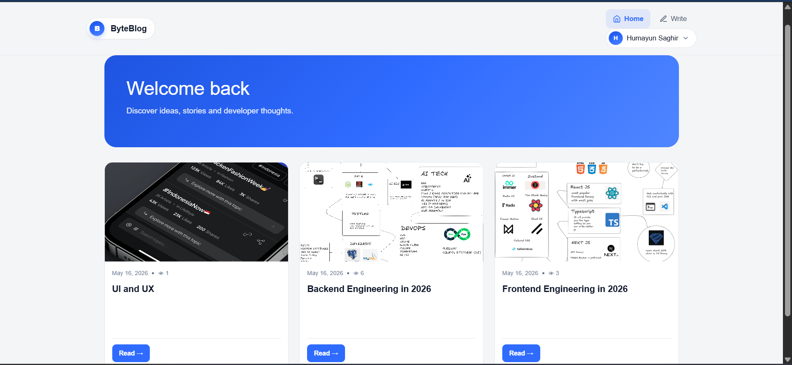
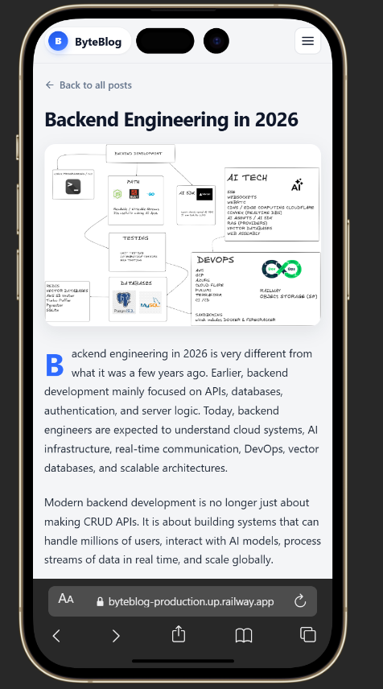
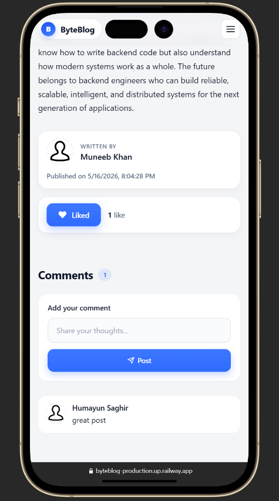
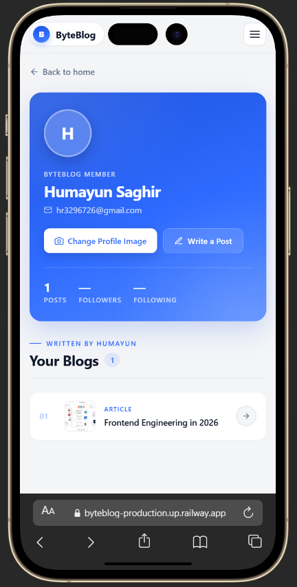

# ByteBlog

A full-stack blogging platform where users can write, publish, and interact with blog posts. Built with Node.js, Express, MongoDB, and EJS.

---

## Screenshots



<p align="center">
  
  
  
</p>

---

## Features

- User authentication with signup and signin (JWT-based, stored in cookies)
- Password hashing using HMAC SHA-256 with salt
- Create and publish blog posts with cover images
- Like and comment on posts
- View count tracking per blog
- User profiles with profile image upload
- Role-based user system (USER / ADMIN)
- Server-side rendering with EJS templates

---

## Tech Stack

- **Runtime:** Node.js
- **Framework:** Express.js
- **Database:** MongoDB + Mongoose
- **Templating:** EJS
- **Authentication:** JSON Web Tokens (JWT) + cookie-parser
- **File Uploads:** Multer
- **Environment Variables:** dotenv

---

## Local Setup

**1. Clone the repository**
```bash
git clone https://github.com/HumayunSaghir/ByteBlog.git
cd ByteBlog
```

**2. Install dependencies**
```bash
npm install
```

**3. Create a `.env` file in the root directory**
```
MONGO_URL=mongodb://127.0.0.1:27017/blogify
secret=your_jwt_secret
```

**4. Start the development server**
```bash
npm run dev
```

The app will be running at `http://localhost:8000`

---

## Deployment

This project is deployed using **Railway** (Node.js hosting + MongoDB database).

### Steps to deploy your own instance

1. Push the project to a GitHub repository
2. Go to [railway.app](https://railway.app) and sign in with GitHub
3. Create a new project → **Deploy from GitHub repo** → select this repository
4. Add a MongoDB database: click **+ New** → **Database** → **Add MongoDB**
5. Go to the ByteBlog service → **Variables** tab and add:
   - `MONGO_URL` → `${{MongoDB.MONGO_URL}}`
   - `secret` → your JWT secret string
6. Go to **Settings** → **Networking** → **Generate Domain** to get your live URL

Every push to the `master` branch will trigger an automatic redeploy.

> **Note:** Uploaded images (blog covers, profile pictures) are stored on the server filesystem. On Railway's free tier, these are cleared on each redeploy. For persistent image storage in production, integrate a cloud storage service such as Cloudinary or AWS S3.

---

## Project Structure

```
ByteBlog/
├── controllers/       # Route handler logic
├── middlewares/       # Auth check, request logger
├── models/            # Mongoose schemas (users, blogs, comments, likes)
├── public/            # Static assets (CSS, images, uploads)
├── routes/            # Express routers
├── services/          # JWT token utilities
├── views/             # EJS templates
├── app.js             # App entry point
└── connection.js      # MongoDB connection
```

---

## Environment Variables

| Variable    | Description                        |
|-------------|------------------------------------|
| `MONGO_URL` | MongoDB connection string          |
| `secret`    | Secret key used for signing JWTs   |
